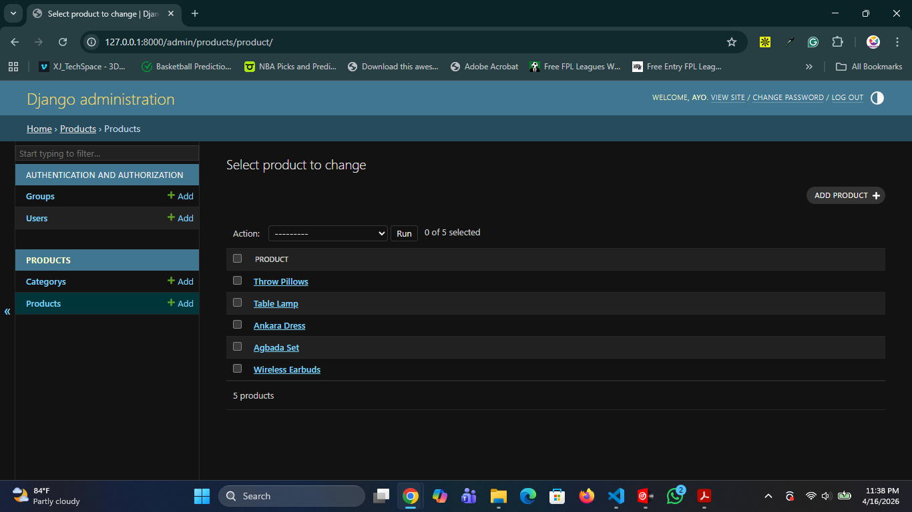
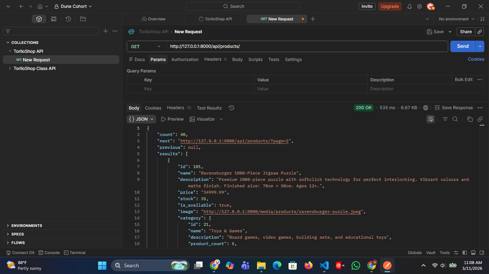
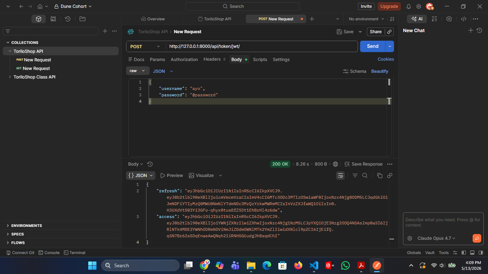
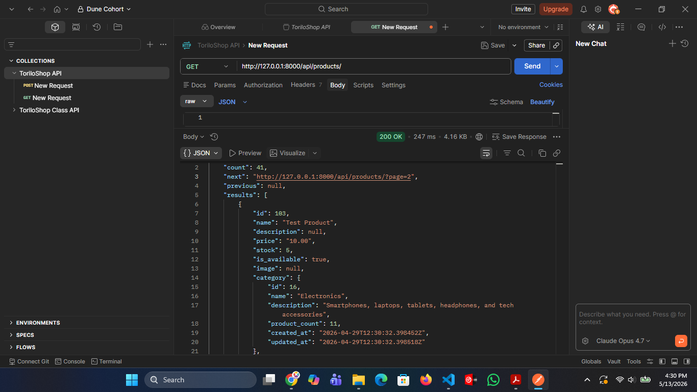

# Backend Dune Cohort | Instructor: Mr. Ayo Oyewo

## Django Modules Progress

This repository contains all Django assignment solutions for all Backend Cohorts.  
Across Modules 7–15, the ToriloShop project evolved from a basic Django application into a secure, production-ready e-commerce API built with Django REST Framework and prepared for real-world deployment.

---

# ToriloShop — Full Project Overview

ToriloShop is a modern e-commerce backend application built using Django and Django REST Framework (DRF). The project progressively introduced core backend engineering concepts including:

- Django fundamentals
- Models and relationships
- Authentication systems
- File uploads and media handling
- REST API development
- JWT authentication
- API security
- Pagination and filtering
- Production deployment preparation
- PostgreSQL configuration
- Gunicorn and WhiteNoise setup
- Environment variable management
- Production-ready deployment workflows

The final result is a scalable, secure, and deployment-ready backend API suitable for frontend applications, mobile apps, and third-party integrations.

---

# Final Features Implemented

## Core Django Features

- Django project structure and reusable apps
- Models, migrations, and admin customisation
- Dynamic templates and template inheritance
- Static files and media uploads
- Product and category management
- User authentication system
- Protected routes and permissions

---

## REST API Features

- Django REST Framework integration
- JSON API responses
- CRUD API operations
- Serializers and nested serializers
- APIView and generic views
- Product and category API endpoints
- Proper HTTP status codes
- Postman API testing

---

## Authentication & Security Features

- DRF Token Authentication
- JWT Authentication using SimpleJWT
- Protected endpoints with `IsAuthenticated`
- User-based product ownership
- Secure authorization headers
- CORS configuration using `django-cors-headers`
- Filtering, searching, and ordering support
- Pagination with metadata support

---

## Production Deployment Features

- `.env` environment variable configuration
- Secure `SECRET_KEY` handling
- PostgreSQL-ready database configuration
- `dj-database-url` integration
- Gunicorn production server setup
- WhiteNoise static file serving
- `requirements.txt` generation
- `collectstatic` configuration
- Render deployment preparation
- Production-ready Django settings

---

# Technologies Used

| Technology            | Purpose                         |
| --------------------- | ------------------------------- |
| Django                | Backend framework               |
| Django REST Framework | API development                 |
| SQLite                | Development database            |
| PostgreSQL            | Production database             |
| JWT                   | Secure API authentication       |
| Gunicorn              | Production WSGI server          |
| WhiteNoise            | Static file serving             |
| django-filter         | API filtering                   |
| Pillow                | Image handling                  |
| python-decouple       | Environment variable management |
| dj-database-url       | PostgreSQL URL parsing          |
| Postman               | API testing                     |

---

# Major API Features

| Endpoint              | Description              |
| --------------------- | ------------------------ |
| `/api/products/`      | Product CRUD operations  |
| `/api/categories/`    | Category API endpoint    |
| `/api/token/`         | JWT token authentication |
| `/api/token/refresh/` | JWT token refresh        |
| `/admin/`             | Django admin dashboard   |

---

# Security Features Implemented

- JWT token authentication
- Token-based authorization
- Environment variable protection
- `.env` excluded from Git tracking
- `DEBUG=False` production setup
- Protected write operations
- CORS middleware configuration
- Ownership-based permissions

---

# Production Deployment Stack

| Feature               | Implementation  |
| --------------------- | --------------- |
| Production Server     | Gunicorn        |
| Static Files          | WhiteNoise      |
| Environment Variables | python-decouple |
| Production Database   | PostgreSQL      |
| Database Parsing      | dj-database-url |
| Deployment Platform   | Render          |

---

# Selected Project Screenshots

## Django Admin Dashboard



---

## Product API JSON Response



---

## JWT Authentication



---

## Paginated API Response



---

# Final Production Readiness Checklist

- Environment variables configured
- PostgreSQL-ready database setup completed
- Gunicorn configured successfully
- WhiteNoise configured for static files
- `requirements.txt` generated
- `collectstatic` executed successfully
- `.env` excluded from Git tracking
- API authentication fully secured
- JWT authentication implemented
- API pagination and filtering completed
- Repository prepared for Render deployment

---

# How to Run the Final Project

```bash
git clone <your-repository-url>

cd module-15/toriloshop

python -m venv venv

venv\Scripts\activate
# source venv/bin/activate

pip install -r requirements.txt

python manage.py migrate

python manage.py createsuperuser

python manage.py runserver
```

---

# Production Run Command

```bash
gunicorn toriloshop.wsgi:application
```

---

# Instructor

## Mr. Ayo Oyewo

Software Engineer, AI Solutions Architect, and Co-founder of XJ TechSpace.

Specialised in:

- Backend Engineering
- AI Solutions
- Full-Stack Development
- API Development
- DevOps & Deployment
- Technical Writing
- Software Architecture

---

# Final Note

This repository represents the complete backend engineering journey for all Backend Cohorts, covering modern Django backend development from beginner-level concepts to production deployment preparation.